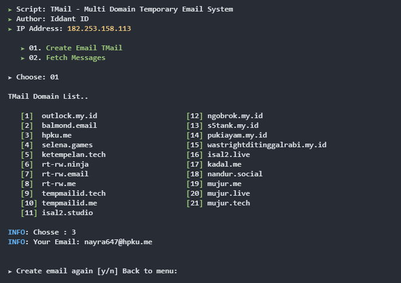
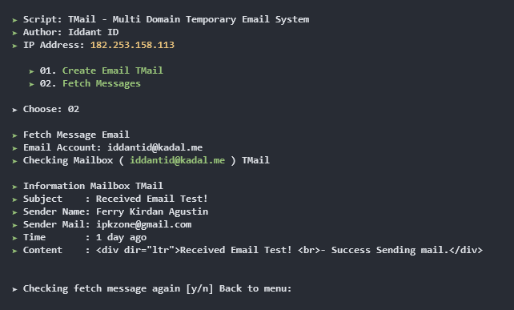
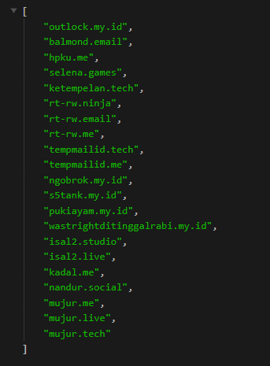
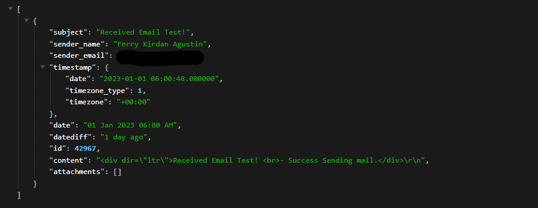

# TMail Project CLI

# 01. Create email with random name
<center></center>

# 02. Fetch message email
<center></center>

# Installations tools & LIB
```shell
$ uname -a ( for check karnel )
  example : aarch64 & armv7

$ git clone https://github.com/ipkzone/TMail-Project-CLI
$ cd TMail-Project-CLI/installer
$ php installer.php --yourkarnel

Choose Karnel for install lib
    --armv7_php7
    --aarch64_php7
    --armv7_php8
    --aarch64_php8
    
# Installing script TMail CLI
$ git clone https://github.com/ipkzone/TMail-Project-CLI
$ cd TMail-Project-CLI
$ php TMail.php

```
# API TMail
- TMail API Example
```shell
* Get list Domain
https://outlock.my.id/api/domains/[apikey]

* Create Email TMail
https://outlock.my.id/api/email/[email]/[apikey]

* Fetch Message
https://outlock.my.id/api/messages/[email]/[apikey]

```
- https://outlock.my.id/api/domains/[apikey]
<center></center>

- https://outlock.my.id/api/messages/[email]/[apikey]
<center></center>

# Note
If you need API KEY TMail Email system, you can contact me because apikey is not free.

regards,
**Iddant ID**


